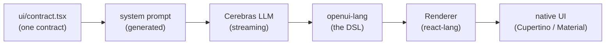

<h1 align="center">AppLess &middot; a phone with no apps. just ask.</h1>

<p align="center">
  Every screen is generated the moment you ask, streamed live, and rendered in
  real native UI: Cupertino on iOS, Material 3 on Android.
</p>

<p align="center">
  <a href="https://openui.com">openui.com</a> &nbsp;&middot;&nbsp;
  <a href="#demo">Demo</a> &nbsp;&middot;&nbsp;
  <a href="#quick-start">Quick start</a> &nbsp;&middot;&nbsp;
  <a href="#how-it-works">How it works</a>
</p>

<p align="center">
  
  
  
</p>

---

## Demo

<p align="center">
  
</p>

There are no apps to install, no menus to learn, no home screen full of icons.
You open AppLess and ask for what you want, and the screen for it is generated
on the spot: a weather dashboard, a restaurant list with live search, a booking
form, a chat thread. Tap anything and the next screen is generated too, already
prefetched so it appears instantly.

It is a demo of what a **generative UI operating system** feels like, built
entirely on [OpenUI](https://openui.com), the open standard for LLM-generated
interfaces. The model does not return JSON or hand-written screens; it writes
**openui-lang**, a compact streaming-first UI language that the OpenUI renderer
turns into live, interactive native components.

> [!WARNING]
> **AppLess is an experiment** by the creators of [OpenUI](https://openui.com) to
> push the boundaries of Generative UI, with no real integrations behind it. Screen
> _content_ is generated by the model: turn on the optional web and image tools and
> it can be grounded in real data (real places, prices, news, photos); without them
> it is plausible fiction. The _actions_ are always simulated, though. "Order
> placed", "flight booked", "payment sent", and live health stats do nothing and
> reflect no real state, because nothing is wired up yet. It is a glimpse of what a
> generative-UI OS could feel like, not a working replacement for your apps, at
> least until someone [makes it real](#fork-it-and-make-it-yours).

## Quick start

```bash
git clone https://github.com/thesysdev/appless.git
cd appless
npm install            # postinstall applies the react-lang patch
npm run ios            # or: npm run android, or npm start for Expo Go
```

On first launch the app asks for a free [Cerebras](https://cloud.cerebras.ai)
API key and stores it on-device (Keychain / Keystore). Generation runs straight
from the phone to the model. There is no backend to deploy.

To skip the key prompt during development, or to turn on optional tools, drop a
`.env.local` in the project root:

```bash
EXPO_PUBLIC_CEREBRAS_API_KEY=csk-...    # skip the first-launch key screen
# EXPO_PUBLIC_EXA_API_KEY=              # enable the web_search tool (Exa)
# EXPO_PUBLIC_UNSPLASH_ACCESS_KEY=      # real semantic photos (else LoremFlickr)
# EXPO_PUBLIC_GENOS_MODEL=gemma-4-31b
# EXPO_PUBLIC_CEREBRAS_BASE_URL=        # any OpenAI-compatible endpoint
```

> **These env vars are for local development only.** Expo inlines every
> `EXPO_PUBLIC_*` value into the JS bundle at build time - anyone with the
> build can extract them. Never distribute a build with keys set this way:
> the Cerebras key belongs in the first-launch prompt (on-device Keychain /
> Keystore), and if you ship with Exa/Unsplash enabled, front those APIs
> with a rate-limited proxy you control instead of embedding the keys.

> Expo SDK 54 is pinned to match the Expo Go build on the App Store and Play
> Store. If your Expo Go reports a different SDK, run
> `npx expo install expo@^<version> && npx expo install --fix`.

## How it works



One contract, `ui/contract.tsx`, is the single source of truth for every
component the model can use: its name, its props, and a description. That
contract generates the system prompt, so the model always knows exactly the UI
vocabulary the app can render. As tokens stream back, the OpenUI
[`<Renderer>`](https://openui.com) parses openui-lang incrementally and paints
real native components, live, before the response has even finished.

Two design systems implement that one contract, so the same generated screen
renders as **Cupertino** on iOS and **Material 3** on Android with no change to
the prompt. Tapping a row, chip, or button streams the next screen; the app
speculatively prefetches likely destinations so navigation feels instant.

**Real tools, in the app.** When a screen needs live facts (news, prices, real
places), the model calls a `web_search` tool ([Exa](https://exa.ai)) mid-stream
and composes the screen from the results, sources cited. Images are referenced
as semantic queries the app resolves on-device.

## Packages

AppLess is a thin, native shell over the OpenUI runtime. The heavy lifting is
the OpenUI stack:

| Package | Role |
| --- | --- |
| [`@openuidev/react-lang`](https://openui.com) | The OpenUI runtime: parses streaming openui-lang and renders it through a pluggable component library. The core of the whole app. |
| [`expo`](https://expo.dev) / [`react-native`](https://reactnative.dev) | The native app runtime (Expo SDK 54, New Architecture). |
| [`react-native-svg`](https://github.com/software-mansion/react-native-svg) | Chart geometry shared across both design systems. |
| [`react-native-webview`](https://github.com/react-native-webview/react-native-webview) | Keyless Google Maps embed for `MapView`. |
| [`expo-linear-gradient`](https://docs.expo.dev/versions/latest/sdk/linear-gradient/) | Card and hero gradients. |
| [`lucide-react-native`](https://lucide.dev) / [`phosphor-react-native`](https://phosphoricons.com) | Icon sets for generated rows and the home shell. |
| [`expo-secure-store`](https://docs.expo.dev/versions/latest/sdk/securestore/) | On-device storage for the user's API key (Keychain / Keystore). |
| [`zod`](https://zod.dev) | Prop schemas in the component contract. |
| [`@react-native-community/slider`](https://github.com/callstack/react-native-slider) | Native slider input for forms. |

**About the system prompt.** The prompt the model runs on is a committed
artifact (`src/genos/generated/system-prompt.ts`), so a fresh clone builds and
runs as-is. `npm run generate:prompt` does not generate it - it *embeds* a
prompt produced by the sibling `appless-os` web repo's `openui generate` step,
adapting it to the native contract. You only need that repo (checked out as a
sibling directory, or pass the prompt file explicitly:
`npm run generate:prompt -- /path/to/system-prompt.txt`) when you change the
component contract in `src/genos/ui/contract.tsx` - a contract change without
a prompt regeneration means the model never hears about your new components.

Screens are generated by [Cerebras](https://cloud.cerebras.ai); live search is
powered by [Exa](https://exa.ai). Both are bring-your-own-key.

## Design systems

The model-facing contract and the design languages are deliberately separate so
platforms can look native without ever drifting the prompt:

- [`ui/contract.tsx`](src/genos/ui/contract.tsx) - component names, prop schemas,
  and descriptions. The single source that generates the system prompt.
- [`ui/cupertino/`](src/genos/ui/cupertino) - iOS renderers: inset grouped
  lists, icon badges, segmented tabs, iOS switch.
- [`ui/material/`](src/genos/ui/material) - Android renderers: Material 3 tonal
  surfaces, ripple, filter chips, underline tabs, native switch.
- [`ui/shared/`](src/genos/ui/shared) - chart, map, form, and image logic shared
  by every design system.

## Tests

```bash
npm test    # renders exemplar generated screens through the full
            # parser -> Renderer -> native component pipeline (jest-expo,
            # headless), for both Cupertino and Material renderer sets
```

## Fork it and make it yours

The actions and state are simulated only because nothing is wired to a real
service yet, and that missing piece is usually just one integration. We would
love for you to fork AppLess and make it real:

- **Real food ordering** - wire in the DoorDash or Uber Eats API and the food
  screens order you actual dinner.
- **A real Yelp** - add the Google Places API so "restaurants nearby" returns
  real venues, hours, photos, and reviews.
- **A real wallet** - connect Plaid and the banking screens show your real
  balance and transactions.
- **A real day** - hook up the Google Calendar API and "what does my day look
  like" becomes actually your day.
- **Real music** - drop in the Spotify API and the player controls real playback.

Pick a screen, give the model a tool that returns real data and somewhere to send
the action, and the demo turns into a working app. Open a PR - we would love to
see what you build.

Before you ship anything, run the local gate:

```bash
npm run check   # typecheck + full test suite with coverage floors
```

The suite covers the pieces new features lean on - session lifecycle and
stream cancellation, prefetch, the tool-call loop (caps, timeouts, auth
failures), the form-state trust boundary, URL/image allowlists, renderer
a11y semantics, and an end-to-end shell smoke test - so a red run means a
foundation you were standing on moved.

## Learn more

AppLess is one of many things you can build on OpenUI. To use the same
generative-UI stack in your own product, start at **[openui.com](https://openui.com)**
and the [OpenUI repository](https://github.com/thesysdev/openui).

## Telemetry

AppLess sends one anonymous `appless_app_launched` event to
[PostHog](https://posthog.com) on startup, so we can see how many people build
and run the experiment. It carries
only an anonymous per-device id and your platform (iOS / Android / web). No
prompts, screen content, API keys, or personal data are ever collected. Opt out
any time:

```bash
EXPO_PUBLIC_POSTHOG_DISABLED=1   # or the standard DO_NOT_TRACK=1
```

## License

MIT. See [LICENSE](LICENSE).
